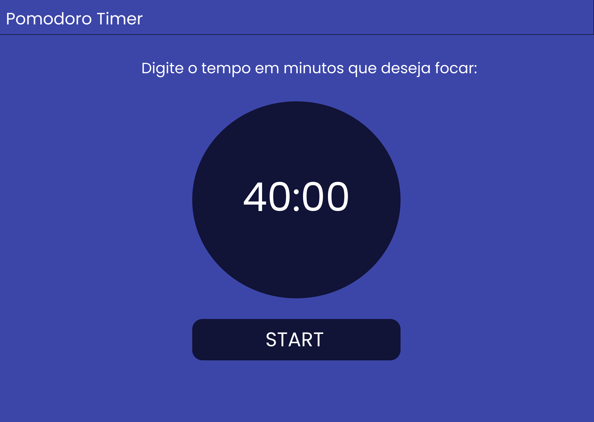

# pomodoro-timer

## 🚀 Sobre o Projeto
Este projeto foi concebido como uma implementação personalizada da técnica Pomodoro, visando aprimorar a organização pessoal. A aplicação inclui as seguintes funcionalidades:

* Lista de Tarefas (Tasks): Permite ao usuário registrar e gerenciar as tarefas diárias, facilitando a priorização e o acompanhamento das atividades a serem realizadas.

* Timer: O projeto conta com um cronômetro que pode ser iniciado e pausado através de botões dedicados:

* Start: Aciona o temporizador, permitindo que o usuário se concentre na tarefa em questão por um período definido.

* Pause: Interrompe o temporizador e reinicia a contagem, proporcionando flexibilidade ao usuário.

Este sistema foi desenvolvido para auxiliar na gestão do tempo e na melhoria da produtividade, integrando a técnica Pomodoro com uma interface intuitiva e funcional.

## 📦 Tecnologias Utilizadas
* HTML
* CSS
* JavaScript (Client Side)

## 📌 Objetivo 
O objetivo deste projeto é testar e aprimorar meus conhecimentos e habilidades em desenvolvimento web. Através da prática e da implementação de novas funcionalidades, busco aprofundar minha compreensão das tecnologias web e melhorar minha capacidade de criar aplicações eficientes e responsivas

## 📞Contato
* Gabriel Vitor Siqueira
* LinkedIn: [linkedin.com/in/seulinkedin](https://www.linkedin.com/in/gabriel-vitor-siqueira/)
